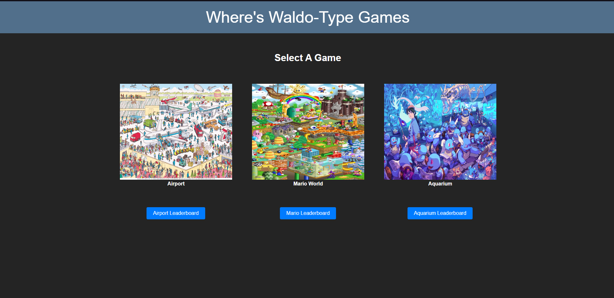
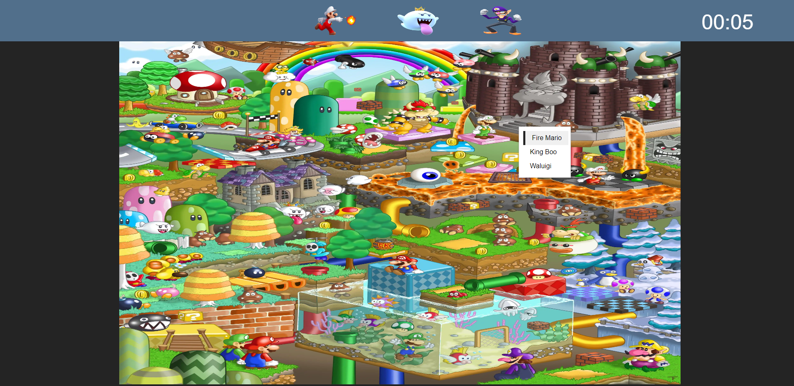
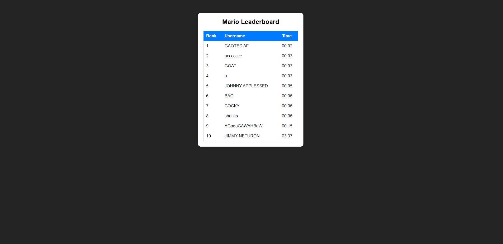
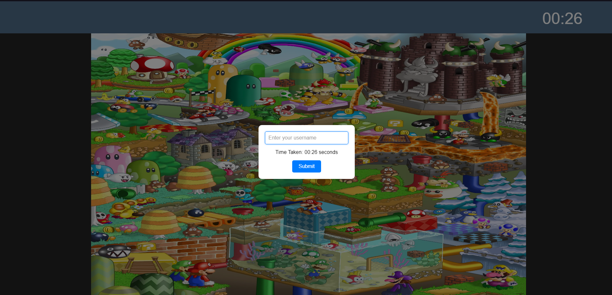

# where-is-waldo

### Summary

This app implements an interactive version of "Where's Waldo?", a game where players try to find several characters hidden inside a picture. In this version, players are timed. Upon completion, the user then enters their name into a leaderboard.

### Technologies

- ReactJS
- react-router-dom
- CSS
- MongoDB
- Mongoose
- ExpressJS

### Features

- Responsive design
- Multiple levels stored in MongoDB Atlas
- Real-time character verification
- Global leaderboard without login
- Multiple levels to play

### Screenshots

#### Menu

#### In-Game

#### Leaderboard

#### Finished

